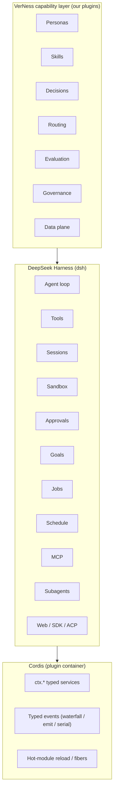
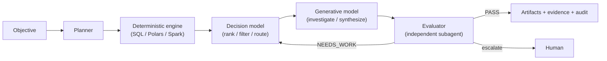
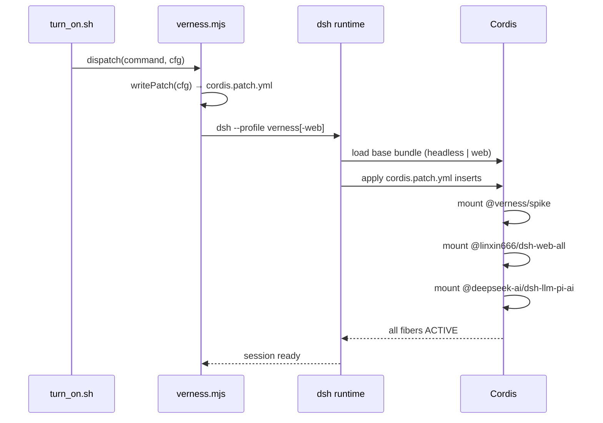
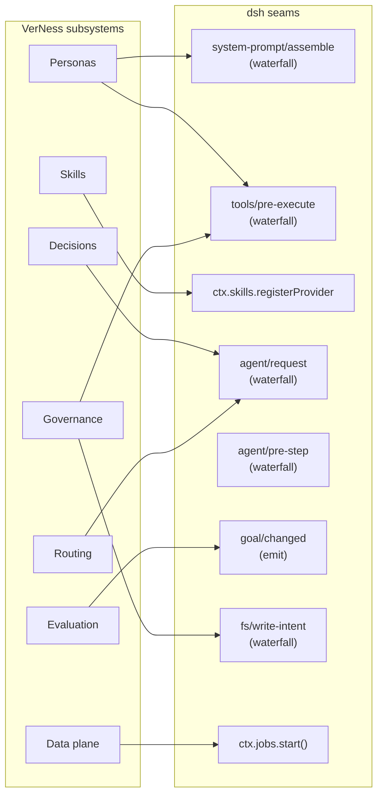

# VerNess

> A model-agnostic, plugin-native AI execution harness — where an LLM is only one class of compute resource.

Built on the **DeepSeek Harness (dsh)** / Cordis substrate. VerNess adds the seven subsystems that `dsh` deliberately leaves open: personas, skills, decisions, routing, evaluation, governance, and a data plane.

---

## Table of Contents

- [What is VerNess?](#what-is-verNess)
- [Setup](#setup)
- [Usage](#usage)
- [Features](#features)
- [Architecture](#architecture)
- [Dependencies](#dependencies)
- [Roadmap](#roadmap)
- [Releases](#releases)
- [Development](#development)
- [Project Structure](#project-structure)
- [Contributing](#contributing)

---

## What is VerNess?

VerNess treats an LLM as one node in a multi-compute pipeline. A task first passes through cheap deterministic engines (SQL, Polars, DuckDB), then a decision model (rules or a small classifier), and only reaches a generative LLM if cheaper computation cannot resolve it.

The system is fully plugin-native: every capability — models, tools, skills, sessions, the UI — is a Cordis plugin. VerNess adds plugins on top of `dsh` without touching the substrate.

---

## Setup

### Prerequisites

| Tool | Version |
|------|---------|
| Node.js | `^22.19.0` or `>=24.0.0` |
| pnpm | `11.7.0` (installed automatically) |
| dsh | `0.1.7-rc.2` (installed automatically) |
| Ollama | latest (installed automatically on first run) |

### First-time install

```sh
# macOS / Linux
./turn_on.sh setup

# Windows
.\turn_on.ps1 setup
```

This command:
1. Verifies your Node version
2. Installs `pnpm` and `@deepseek-ai/dsh` globally (pinned versions)
3. Fetches the `upstream/deepseek-harness` submodule
4. Creates **two profiles** in `~/.dsh/profiles/`:
   - `verness` — headless/CLI profile
   - `verness-web` — browser UI profile (dsh-web-ui)
5. Installs all plugins (`@verness/spike`, `@linxin666/dsh-web-all`, etc.)
6. Starts Ollama and pulls the configured model

### Verify the installation

```sh
./turn_on.sh doctor
```

Expected output shows `ok` for node, pnpm, dsh, engine, both profiles, and the upstream submodule.

---

## Usage

### CLI (interactive REPL)

```sh
./turn_on.sh
```

Opens the headless REPL. Type a task directly or use `/command` shortcuts.

```
verness> /help
verness> What is the capital of France?
verness> /persona data-analyst
verness> /model reset
verness> /off
```

### Web UI (browser)

```sh
./turn_on.sh web
```

Opens the `verness-web` profile — a full browser interface powered by **dsh-web-ui** with:
- Kanban task board
- Git graph and SCM panel
- Plugin manager
- Live token stats
- Mobile remote access

`./turn_on.sh ui` is an alias. The persona, route/model and access mode are read when the server starts, so after changing any of them restart the UI: `./turn_on.sh off`, then `./turn_on.sh web`.

### One-shot tasks

```sh
# Works in both CLI and web configurations
./turn_on.sh "summarise the last 5 git commits"
./turn_on.sh --continue "now format it as a changelog"
```

### Model lifecycle

```sh
./turn_on.sh up      # start Ollama + pull model weights
./turn_on.sh stats   # memory / token throughput
./turn_on.sh down    # unload model, free memory
./turn_on.sh off     # turn everything off: web UI, decision sidecar and model
```

`off` (alias `stop`, `/off` in the REPL) stops all three in one go. Add `--force` to also stop servers VerNess did not start.

### Task dashboard

```sh
verness> /dashboard           # alias /dash, inside the REPL
node scripts/dashboard.mjs    # same, from a plain shell
```

Builds a static HTML page at `.verness/dashboard.html` (no server, no network) and opens it:
- **Backlog** — every open task in `docs/03-BACKLOG.md`, with a P0–P3 priority picker (kept in your browser), filters, sort, and *copy as markdown*; the backlog file itself is rendered below.
- **Sessions** — turns, tool calls, tokens and wall time; click a row for its full timeline.
- **Decisions and teams** — shadow decisions (model vs. rules agreement, latency) and per-task team outcomes.

Add `--no-open` to only write the file, `--limit N` to cap the session list.

### Configuration

All configuration lives in `verness.config.json`. Edit it and run `./turn_on.sh sync` to push changes to both profiles without a full re-setup.

```jsonc
{
  "model": {
    "source": "hf.co/Qwen/Qwen3-0.6B-GGUF:Q8_0",  // any Ollama or HF GGUF model
    "contextWindow": 32768
  },
  "personas": {
    "active": "generalist"
  }
}
```

---

## Features

| Feature | Status | Notes |
|---------|--------|-------|
| CLI / headless REPL | ✅ | `./turn_on.sh` |
| Browser UI (dsh-web-ui) | ✅ | `./turn_on.sh web` |
| Local model (Ollama) | ✅ | auto-installs engine + weights |
| Remote/cloud models | ✅ | any OpenAI-compatible endpoint |
| Slash commands | ✅ | one file per command in `scripts/commands/`; `/help` lists them |
| Task dashboard + backlog | ✅ | `/dashboard`: prioritise open tasks, inspect sessions and costs |
| Teams / `/loop-task` | ✅ | several tasks under different personas; `teams/*.json` |
| Contracts (`@verness/contracts`) | ✅ M2 | types only, zero dependencies |
| Persona files + `/persona check` | ✅ M2 | `personas/*.json`, validated at load; persona-scoped commands |
| Decisions (shadow mode) | 🔄 M3 | Laya sidecar logs model-vs-rules; not yet authoritative |
| Persona system | 🔄 M4 | identity = skills + tools + model policy; persona files validated (M2) |
| Skills | 🔄 M5 | procedural knowledge, trigger-based |
| Decision model | 🔄 M3 | rules → small model → LLM escalation |
| Model routing | 🔄 M6 | capability-based selection |
| Evaluation loop | 🔄 M7 | generator ≠ evaluator |
| Data plane (SQL/DuckDB) | 🔄 M8 | volume without hitting the LLM |
| Governance / audit | 🔄 M9 | budgets, RBAC, audit trail |

✅ = available now · 🔄 = planned (milestone in parentheses)

---

## Architecture

### Layer model



### Adaptive pipeline



**Budget shape example** for 500M rows:
`500M rows → SQL → 100k rows → decision model → 5k rows → LLM → evaluator → report`

### Plugin loading flow



### Contract seam map

Every VerNess subsystem attaches through a documented `dsh` seam — no agent-loop edits.



---

## Dependencies

### Runtime

| Package | Role |
|---------|------|
| `@deepseek-ai/dsh` `0.1.7-rc.2` | Substrate: agent loop, tools, sessions, sandbox |
| `@deepseek-ai/cordis` `4.0.4` | Plugin container (peer dep, vendored in upstream) |
| `@deepseek-ai/dsh-llm-pi-ai` | OpenAI-compatible LLM adapter (Ollama, cloud) |
| `@deepseek-ai/dsh-tools` | Tool scheduling (linked to runtime copy) |
| `@linxin666/dsh-web-all` | Browser UI panel collection (dsh-web-ui) |
| `@verness/spike` | M1 load-bearing spike plugin |

### Toolchain

| Tool | Version | Purpose |
|------|---------|---------|
| Node.js | `^22.19.0 \|\| >=24.0.0` | Runtime |
| pnpm | `11.7.0` | Package manager |
| Ollama | latest | Local model engine |
| TypeScript | via upstream | Type checking |

### Optional

| Tool | Purpose |
|------|---------|
| `engram` | Knowledge graph (`./turn_on.sh graph`) |
| Laya / Jev | Decision model sidecar (`./turn_on.sh decision up`) |

Engram: install with `npm i -g @sentropic/engram`, then `engram install` to give Claude Code the `/engram` skill. `./turn_on.sh graph` rebuilds the code graph (`engram update .`, AST only, no LLM calls) into the gitignored `.engram/`. See `docs/06-SETUP-AND-LAUNCHER.md` and ADR-0005.

---

## Roadmap

| Milestone | Name | Status |
|-----------|------|--------|
| M0 | Foundation & plan | ✅ done |
| M1 | Load-bearing spike (`@verness/spike`) | ✅ done |
| M2 | Contracts (`@verness/contracts`) | ✅ done |
| M3 | Decisions (`@verness/decisions`) | 🔜 next |
| M4 | Personas (`@verness/personas`) | 📋 todo |
| M5 | Skills (`@verness/skills`) | 📋 todo |
| M6 | Routing (`@verness/routing`) | 📋 todo |
| M7 | Evaluation & goal loop | 📋 todo |
| M8 | Data plane (`@verness/data`) | 📋 todo |
| M9 | Governance (`@verness/governance`) | 📋 todo |

Each milestone is independently runnable. See `docs/02-ROADMAP.md` for exit criteria.

---

## Releases

| Tag | Contents |
|-----|----------|
| `v0.2.0` | M2: `@verness/contracts`, persona files validated at load (`/persona check`), `data-analyst` and `reviewer` personas, persona-scoped commands |
| `v0.1.0` | M0/M1: launcher, local model lifecycle, web UI, load-bearing spike plugin |

Open work (not yet released) lives on `epic`; the prioritised list is in `docs/03-BACKLOG.md` and on the dashboard.

---

## Development

```sh
pnpm install      # dev tooling only (TypeScript); runtime deps come from ./turn_on.sh setup
pnpm test         # node --test: scripts/test/*.test.mjs + packages/*/test/*.test.ts
pnpm typecheck    # tsc -p packages/contracts
```

Adding a slash command means adding one file in `scripts/commands/` (see `docs/07-COMMAND-LAYER.md`).

---

## Project Structure

```
VerNess/
├── turn_on.sh / turn_on.ps1 / turn_on.cmd  # cross-platform launcher
├── verness.config.json                      # all day-to-day configuration
├── scripts/
│   ├── verness.mjs                          # launcher entry point
│   ├── model.mjs                            # model lifecycle (up/down/stats)
│   ├── dashboard.mjs                        # builds .verness/dashboard.html
│   ├── commands/                            # one file per slash command
│   ├── lib/                                 # REPL, personas, decisions, backlog, pet…
│   └── test/                                # node:test suites (pnpm test)
├── packages/
│   ├── contracts/                           # @verness/contracts (M2, types only)
│   └── spike/                               # @verness/spike (M1 proof-of-concept)
├── profiles/
│   └── verness/cordis.patch.yml             # generated — do not edit by hand
├── personas/                                # persona JSON files (+ <id>/commands/*.mjs)
├── teams/                                   # multi-agent team configs
├── .claude/skills/terse/                     # agent skill: terse, low-token replies
├── upstream/
│   └── deepseek-harness/                    # git submodule, READ-ONLY
└── docs/                                    # architecture, roadmap, backlog, ADRs
    ├── 00-OVERVIEW.md
    ├── 01-ARCHITECTURE.md
    ├── 02-ROADMAP.md
    ├── research/                            # distilled substrate knowledge
    └── adr/                                 # architectural decision records
```

> **The upstream submodule is read-only.** Never edit files inside `upstream/deepseek-harness/`. All VerNess code lives in `packages/` as Cordis plugins.

---

## Contributing

- Feature and fix branches start from `epic` and merge back into it; `main` only receives tagged releases (`vX.Y.Z`). See "Branches and versions" in `docs/05-CONVENTIONS.md`.
- Commits carry no co-author or tool trailers; the rest of the commit rules are in the same file.
- Agents working in this repo can load the `terse` skill (`.claude/skills/terse/SKILL.md`) to keep replies short and cut token cost.
