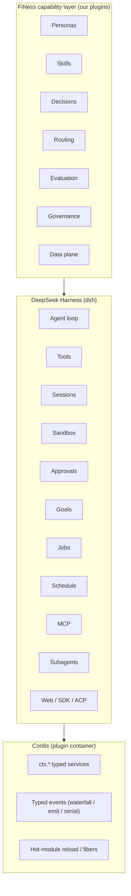
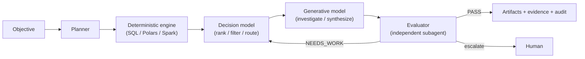
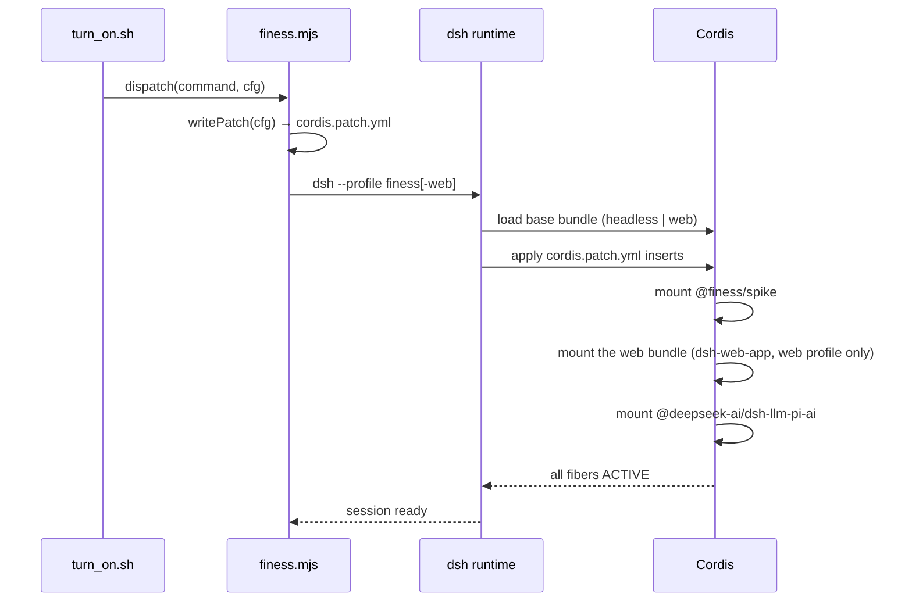
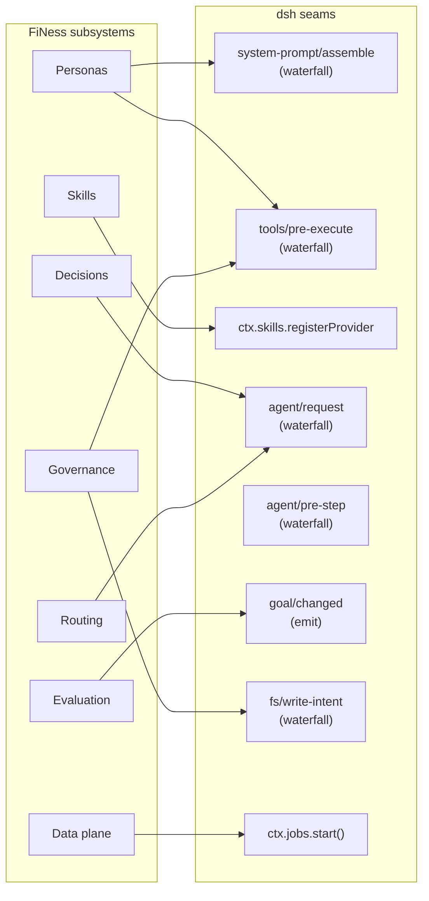

# FiNess

> A model-agnostic, plugin-native AI execution harness — where an LLM is only one class of compute resource.

Built on the **DeepSeek Harness (dsh)** / Cordis substrate. FiNess adds the seven subsystems that `dsh` deliberately leaves open: personas, skills, decisions, routing, evaluation, governance, and a data plane.

---

## Table of Contents

- [What is FiNess?](#what-is-fiNess)
- [FiNess, explained simply](#finess-explained-simply)
- [Setup](#setup)
- [Usage](#usage)
- [Features](#features)
- [Architecture](#architecture)
- [Dependencies](#dependencies)
- [Roadmap](#roadmap)
- [Releases](#releases)
- [Development](#development)
- [Project Structure](#project-structure)
- [Contributing](#contributing)

---

## What is FiNess?

FiNess treats an LLM as one node in a multi-compute pipeline. A task first passes through cheap deterministic engines (SQL, Polars, DuckDB), then a decision model (rules or a small classifier), and only reaches a generative LLM if cheaper computation cannot resolve it.

The system is fully plugin-native: every capability — models, tools, skills, sessions, the UI — is a Cordis plugin. FiNess adds plugins on top of `dsh` without touching the substrate.

---

## FiNess, explained simply

> For a curious 12-year-old, or anyone who has used a chatbot but never written code.

FiNess is an AI helper that runs on your own computer. You type a job, and an AI does it. The big
idea is to **save effort**: most jobs do not need a giant, expensive AI brain, so FiNess wants to
try the cheapest way that works first (a simple rule, a small quick helper, a plain calculation)
and only call a big AI when it has to. **That is the goal, not today's reality.** Today FiNess is a
place to type, a set of AI "job hats", lots of free quick-commands, and a small helper called Laya
that is still *practising*. It is built on top of another program, the **DeepSeek Harness**, which
talks to the AI, runs its tools and saves conversations.

### The main parts

| Part | Think of it as... |
|---|---|
| **The prompt (REPL)**: `finess>`, where you type | The front desk of a school |
| **The model**: the AI brain that writes answers, either local (free, through Ollama) or hosted (a company's servers, costs money) | The student who does the homework |
| **Personas**: 17 job hats (data scientist, QA engineer, HR specialist, ...) that change the AI's instructions | Same student, different hat |
| **Persona commands**: free checklists that appear only while one hat is on | A tool that hangs on one hat |
| **Teams**: several personas working through a task list; one makes, another checks | A group project with a separate checker |
| **Laya**: a small model that only answers multiple-choice questions ("how hard is this job?"). It runs in *shadow mode*: its guess is logged, never used | A trainee referee writing calls in a notebook |
| **Labelling**: you grade Laya's past guesses without seeing them first, so it can be measured and its confidence corrected (*calibration*) | A teacher grading a quiz |
| **The gate**: Laya may only decide once it beats the simple rules, after 50+ graded tasks per question (20 so far). **Not built yet** | A driving test |
| **Dashboard**: a local web page with the to-do list, sessions and Laya's guesses | The school noticeboard |
| **Ness, the pet**: a text-art face showing what is running; happy, sleepy or worried | A school mascot |
| **Web UI**: the same chat in your browser | The front door instead of the side door |

### What you can type

Anything that is not a command goes to the AI as a task. Commands start with `/`, and most cost
nothing because the AI is not involved.

- **core**: `/help` list commands · `/doctor` what is missing · `/new` fresh conversation ·
  `/resume` pick up an old one · `/loop-task` keep working on one goal over several rounds ·
  `/pet` Ness's status · `/sync` apply config edits · `/web` browser chat · `/off` turn everything off
- **model**: `/up` start the model · `/down` free its memory · `/model` show or switch ·
  `/models` install or search local models · `/api` use a hosted AI (key in `.env`) ·
  `/access` how far the AI may reach: read-only, workspace (default) or full
- **decisions**: `/decision up|stats|down` Laya's switch · `/decide <task>` Laya vs the rules,
  side by side · `/dd` count, grade (`label`), score (`report`) and tune (`refit`) Laya's guesses
- **personas**: `/persona` list or switch hats · `/agents` every persona and team
- **teams**: `/team run <id>` run a team of personas over a task list · `/team status [<id>]` per-task results of the latest run
- **telemetry**: `/cost` money per route (zero on a local model) · `/usage` tokens ·
  `/sessions` past conversations · `/tools` tools the AI was offered · `/stats` engine speed and
  memory · `/dashboard` the noticeboard page · `/graph` rebuild the code map (no AI)
- **hat-only checklists** (free, no AI): `/hypotheses` (data scientist) · `/testplan` (QA) ·
  `/dotnet-check` (C#; prints the steps, does not run them) · `/release-check` (DevOps) ·
  `/threats` (security) · `/a11y` (frontend) · `/jd-check` (HR) · `/prd` (product) ·
  `/release-notes` (writer) · `/raid` (project manager) · `/triage` (support)
- **from the shell**: `./turn_on.sh` (or `.\turn_on.cmd`, or `finess` once linked with
  `npm link` — see [06](docs/06-SETUP-AND-LAUNCHER.md)) followed by nothing to start ·
  `"a task"` for one task · `setup` · `doctor` · `up` · `down` · `off` · `web` · `sync` ·
  `decision up`

### A day with FiNess

Start with `.\turn_on.cmd` and Ness says hello. Put on a hat with `/persona qa-engineer`, and
`/testplan` appears. Get a free checklist with `/testplan login page`. Ask the AI to write the
tests; a grey line shows Laya's practice guess next to the rules' guess, and nothing changes
because of it. `/cost` shows zero on a local model. Grade Laya with `/dd label`, look at
`/dashboard`, then `/off`.

### Not built yet, honestly

- Picking the cheapest way automatically is still a plan (milestones M3, M6 and M8). Today you
  pick the model yourself.
- Laya does not decide anything, and its gate is not built.
- Each hat's list of allowed tools is written down but not enforced until M4.
- The FiNess logo in the web UI is planned; the web UI still shows the DeepSeek Harness look, and
  quick-commands do not appear in its `/` menu yet.
- `/btw`, `/config`, `/exit` and other planned commands are in `docs/03-BACKLOG.md`.

The full version: [docs/13-EXPLAINED-SIMPLY.md](docs/13-EXPLAINED-SIMPLY.md).

---

## Setup

### Prerequisites

| Tool | Version |
|------|---------|
| Node.js | `^22.19.0` or `>=24.0.0` |
| pnpm | `11.7.0` (installed automatically) |
| dsh | `0.1.7-rc.2` (installed automatically) |
| Ollama | latest (installed automatically on first run) |

### First-time install

```sh
# macOS / Linux
./turn_on.sh setup

# Windows
.\turn_on.ps1 setup
```

This command:
1. Verifies your Node version
2. Installs `pnpm` and `@deepseek-ai/dsh` globally (pinned versions)
3. Fetches the `upstream/deepseek-harness` submodule
4. Creates **two profiles** in `~/.dsh/profiles/`:
   - `finess` — headless/CLI profile
   - `finess-web` — browser UI profile (`@deepseek-ai/dsh-web-app`)
5. Installs the plugins listed in `finess.config.json` (`@finess/spike`, …)
6. Starts Ollama and pulls the configured model

### Verify the installation

```sh
./turn_on.sh doctor
```

Expected output shows `ok` for node, pnpm, dsh, engine, both profiles, and the upstream submodule.

---

## Usage

### CLI (interactive REPL)

```sh
./turn_on.sh
```

Opens the headless REPL. Type a task directly or use `/command` shortcuts.

```
finess> /help
finess> What is the capital of France?
finess> /persona data-analyst
finess> /model reset
finess> /off
```

### Web UI (browser)

```sh
./turn_on.sh web
```

Opens the `finess-web` profile: the substrate's browser interface (`@deepseek-ai/dsh-web-app`), with:
- chat and sessions, with tool calls, approvals and plans
- side panels for files, a terminal, a browser and document previews
- settings (models, shell, web search, agent loop), a plugin manager and the plugin inventory
- goals, jobs, schedules, subagents and deliverables

plus the **`@linxin666/dsh-web-all`** bundle (`settings.webBundles`): a task board, a Git graph, usage
stats, session archive, model capabilities, a preset and skin center, its own settings and plugin
manager, and a plugin market. SSH, the pet and a few low-use panels ship switched off; turn them on
under Settings → Plugins → Plugin manager. Each panel is fault-isolated: one that breaks is listed at
`GET /api/dsh-web-all/degraded` and the rest keep working.

Your quick-tools work there too: type `/cost`, `/usage`, `/persona`, `/agents`, `/dd`, `/routing` or a
persona command in the message bar. `/model` and `/help` are the web UI's own; `/persona` and `/api`
changes apply after restarting the UI.

It still shows the DeepSeek Harness name and logo; replacing them with FiNess's is planned (T-398).

`./turn_on.sh ui` is an alias. The persona, route/model and access mode are read when the server starts, so after changing any of them restart the UI: `./turn_on.sh off`, then `./turn_on.sh web`.

### One-shot tasks

```sh
# Works in both CLI and web configurations
./turn_on.sh "summarise the last 5 git commits"
./turn_on.sh --continue "now format it as a changelog"
```

### Model lifecycle

```sh
./turn_on.sh up      # start Ollama + pull model weights
./turn_on.sh stats   # memory / token throughput
./turn_on.sh down    # unload model, free memory
./turn_on.sh off     # turn everything off: web UI, decision sidecar and model
```

`off` (alias `stop`, `/off` in the REPL) stops all three in one go. Add `--force` to also stop servers FiNess did not start.

### Task dashboard

```sh
finess> /dashboard           # alias /dash, inside the REPL
node scripts/dashboard.mjs    # same, from a plain shell
```

Builds a static HTML page at `.finess/dashboard.html` (no server, no network) and opens it:
- **Backlog** — every open task in `docs/03-BACKLOG.md`, with a P0–P3 priority picker (kept in your browser), filters, sort, and *copy as markdown*; the backlog file itself is rendered below.
- **Sessions** — turns, tool calls, tokens and wall time; click a row for its full timeline.
- **Decisions and teams** — shadow decisions (model vs. rules agreement, latency) and per-task team outcomes.

Add `--no-open` to only write the file, `--limit N` to cap the session list.

### Configuration

All configuration lives in `finess.config.json`. Edit it and run `./turn_on.sh sync` to push changes to both profiles without a full re-setup.

```jsonc
{
  "model": {
    "source": "hf.co/Qwen/Qwen3-0.6B-GGUF:Q8_0",  // any Ollama or HF GGUF model
    "contextWindow": 32768
  },
  "personas": {
    "active": "generalist"
  }
}
```

### Personas and their own commands

```sh
/persona                        # list personas; the active one is marked
/persona data-scientist         # switch; the prompt, policy and command bar follow
/hypotheses <question>          # exists only while data-scientist is active
```

A persona is one file, `personas/<id>.json`. It can also bring **commands that only it has**:
`personas/<id>/commands/<name>.mjs`, listed in the file's `commands`. These are offered only while
that persona is active, and they usually cost zero tokens (checklists, templates, local
computations). Global commands always win on a name clash. How to write one:
[docs/12-PERSONAS.md](docs/12-PERSONAS.md).

### Decision model (Laya)

```sh
./turn_on.sh decision up       # start the Laya sidecar (first run installs laya[serve])
/decide <task text>            # in the REPL: Laya vs the rules, side by side
/decisions-data label          # label logged decisions (blind); /decisions-data shows the count
/dd label --relabel <words>    # fix a label: re-asks records by id or task words; newest label wins
```

Laya runs in **shadow mode**. It answers three routing questions for each task (`level`, `tier`,
`pipeline`) and the answer is logged to `.finess/decisions/` next to what the rules decided. The
rules still make every real decision.

> **Reminder: Laya only evolves as much as you validate it.** Out of the box it scores close to
> chance. Its decisions improve only through the loop you drive: use it on real tasks, label what
> the right answer was, measure it against the rules, and refit it. A question is handed to Laya
> only when its measured accuracy *and* calibration beat the rules (the T-223 gate). That takes at
> least 50 labelled decisions per question, and about 200 is better. No labels, no progress.

---

## Features

| Feature | Status | Notes |
|---------|--------|-------|
| CLI / headless REPL | ✅ | `./turn_on.sh` |
| Browser UI (`dsh-web-app`) | ✅ | `./turn_on.sh web`; FiNess branding planned (T-398), skin (T-430) |
| Quick-tools in the web UI | ✅ | type `/cost`, `/persona`, `/dd`… in the message bar ([ADR-0011](docs/adr/0011-web-commands-bridge.md)) |
| Local model (Ollama) | ✅ | auto-installs engine + weights |
| Remote/cloud models | ✅ | any OpenAI-compatible endpoint |
| Slash commands | ✅ | one file per command in `scripts/commands/`; `/help` lists them |
| Task dashboard + backlog | ✅ | `/dashboard`: prioritise open tasks, inspect sessions and costs |
| Teams / `/loop-task` | ✅ | several tasks under different personas; `teams/*.json` |
| Contracts (`@finess/contracts`) | ✅ M2 | types only, zero dependencies |
| Persona files + `/persona check` | ✅ M2 | `personas/*.json`, validated at load; persona-scoped commands ([guide](docs/12-PERSONAS.md)) |
| Persona catalog | ✅ | 17 personas in four families, 11 persona-only zero-token commands ([catalog](docs/12-PERSONAS.md#5-the-catalog-and-choosing-between-personas)) |
| Decisions (shadow mode) | ✅ shadow · 🔄 gate | Laya logs model-vs-rules; `/decisions-data` labels, reports and refits; nothing is applied until the gate (T-223) |
| Persona system | 🔄 M4 | identity = skills + tools + model policy; persona files validated (M2) |
| Skills | 🔄 M5 | procedural knowledge, trigger-based |
| Decision model | 🔄 M3 | rules → small model → LLM escalation |
| Model routing | 🔄 M6 | capability-based selection |
| Evaluation loop | 🔄 M7 | generator ≠ evaluator |
| Data plane (SQL/DuckDB) | 🔄 M8 | volume without hitting the LLM |
| Governance / audit | 🔄 M9 | budgets, RBAC, audit trail |

✅ = available now · 🔄 = planned (milestone in parentheses)

---

## Architecture

### Layer model


```mermaid
graph TD
    subgraph FiNess["FiNess capability layer (our plugins)"]
        P[Personas]
        SK[Skills]
        D[Decisions]
        R[Routing]
        E[Evaluation]
        G[Governance]
        DP[Data plane]
    end

    subgraph DSH["DeepSeek Harness (dsh)"]
        AL[Agent loop]
        T[Tools]
        S[Sessions]
        SB[Sandbox]
        AP[Approvals]
        GL[Goals]
        J[Jobs]
        SC[Schedule]
        MCP[MCP]
        SA[Subagents]
        WEB[Web / SDK / ACP]
    end

    subgraph Cordis["Cordis (plugin container)"]
        CTX["ctx.* typed services"]
        EV["Typed events (waterfall / emit / serial)"]
        HMR["Hot-module reload / fibers"]
    end

    FiNess --> DSH --> Cordis
```

### Adaptive pipeline


```mermaid
flowchart LR
    OBJ[Objective] --> PL[Planner]
    PL --> DET["Deterministic engine\n(SQL / Polars / Spark)"]
    DET --> DM["Decision model\n(rank / filter / route)"]
    DM --> GM["Generative model\n(investigate / synthesize)"]
    GM --> EV["Evaluator\n(independent subagent)"]
    EV -->|PASS| OUT[Artifacts + evidence + audit]
    EV -->|NEEDS_WORK| DM
    EV -->|escalate| HUM[Human]
```

This is the **target design** (M3–M8). Today a task goes straight to the model you chose; the decision
model runs in shadow mode only, and no deterministic engine is wired yet.

**Budget shape example** for 500M rows:
`500M rows → SQL → 100k rows → decision model → 5k rows → LLM → evaluator → report`

### Plugin loading flow


```mermaid
sequenceDiagram
    participant TOS as turn_on.sh
    participant VJS as finess.mjs
    participant DSH as dsh runtime
    participant CRD as Cordis

    TOS->>VJS: dispatch(command, cfg)
    VJS->>VJS: writePatch(cfg) → cordis.patch.yml
    VJS->>DSH: dsh --profile finess[-web]
    DSH->>CRD: load base bundle (headless | web)
    DSH->>CRD: apply cordis.patch.yml inserts
    CRD->>CRD: mount @finess/spike
    CRD->>CRD: mount the web bundle (dsh-web-app, web profile only)
    CRD->>CRD: mount @deepseek-ai/dsh-llm-pi-ai
    CRD-->>DSH: all fibers ACTIVE
    DSH-->>VJS: session ready
```

### Contract seam map

Every FiNess subsystem attaches through a documented `dsh` seam — no agent-loop edits.


```mermaid
graph LR
    subgraph FiNess subsystems
        PERS[Personas]
        SKILL[Skills]
        DEC[Decisions]
        ROUT[Routing]
        EVAL[Evaluation]
        GOV[Governance]
        DATA[Data plane]
    end

    subgraph dsh seams
        SP["system-prompt/assemble\n(waterfall)"]
        TPE["tools/pre-execute\n(waterfall)"]
        SKR["ctx.skills.registerProvider"]
        ARQ["agent/request\n(waterfall)"]
        APS["agent/pre-step\n(waterfall)"]
        GC["goal/changed\n(emit)"]
        FSW["fs/write-intent\n(waterfall)"]
        TJ["ctx.jobs.start()"]
    end

    PERS --> SP
    PERS --> TPE
    SKILL --> SKR
    DEC --> ARQ
    ROUT --> ARQ
    EVAL --> GC
    GOV --> FSW
    GOV --> TPE
    DATA --> TJ
```

---

## Dependencies

### Runtime

| Package | Role |
|---------|------|
| `@deepseek-ai/dsh` `0.1.7-rc.2` | Substrate: agent loop, tools, sessions, sandbox |
| `@deepseek-ai/cordis` `4.0.4` | Plugin container (peer dep, vendored in upstream) |
| `@deepseek-ai/dsh-llm-pi-ai` | OpenAI-compatible LLM adapter (Ollama, cloud) |
| `@deepseek-ai/dsh-tools` | Tool scheduling (linked to runtime copy) |
| `@deepseek-ai/dsh-web-app` | The browser UI bundle, part of `dsh` (web profile) |
| `@linxin666/dsh-web-all` | Web bundle (`settings.webBundles`): task board, Git graph, usage, archive, skins, market; web profile only |
| `@finess/spike` | M1 load-bearing spike plugin |

### Toolchain

| Tool | Version | Purpose |
|------|---------|---------|
| Node.js | `^22.19.0 \|\| >=24.0.0` | Runtime |
| pnpm | `11.7.0` | Package manager |
| Ollama | latest | Local model engine |
| TypeScript | via upstream | Type checking |

### Optional

| Tool | Purpose |
|------|---------|
| `engram` | Knowledge graph (`./turn_on.sh graph`) |
| Laya / Jev | Decision model sidecar (`./turn_on.sh decision up`) |

Engram: install with `npm i -g @sentropic/engram`, then `engram install` to give Claude Code the `/engram` skill. `./turn_on.sh graph` rebuilds the code graph (`engram update .`, AST only, no LLM calls) into the gitignored `.engram/`. See `docs/06-SETUP-AND-LAUNCHER.md` and ADR-0005.

---

## Roadmap

| Milestone | Name | Status |
|-----------|------|--------|
| M0 | Foundation & plan | ✅ done |
| M1 | Load-bearing spike (`@finess/spike`) | ✅ done |
| M2 | Contracts (`@finess/contracts`) | ✅ done |
| M3 | Decisions (`@finess/decisions`) | 🔜 next (the launcher-level shadow, labelling and calibration are built) |
| M4 | Personas (`@finess/personas`) | 📋 todo |
| M5 | Skills (`@finess/skills`) | 📋 todo |
| M6 | Routing (`@finess/routing`) | 📋 todo |
| M7 | Evaluation & goal loop | 📋 todo |
| M8 | Data plane (`@finess/data`) | 📋 todo |
| M9 | Governance (`@finess/governance`) | 📋 todo |

Each milestone is independently runnable. See `docs/02-ROADMAP.md` for exit criteria.

---

## Releases

| Tag | Contents |
|-----|----------|
| `v0.4.0` | Your quick-tools in the web UI (`@finess/commands`, ADR-0011), `/exit`, short command names and `//`, `/config`, the calibration gate (`/dd gate`), `/routing`, the feature-delivery team, `dsh-web-all` in the web UI, repo tools. Notes: [CHANGELOG.md](CHANGELOG.md) |
| `v0.3.0` | Decision layer measured: shadow records with probabilities, blind labelling (`/decisions-data label`, `--relabel`), calibration report and held-out temperature refit (`report`, `refit`). Ten new personas with their own zero-token commands, persona `family`, the catalog in `docs/12-PERSONAS.md`. Dashboard backlog with priorities. Windows: no terminal windows flashing at boot. Docs: persona guide, and the project explained simply |
| `v0.2.0` | M2: `@finess/contracts`, persona files validated at load (`/persona check`), `data-analyst` and `reviewer` personas, persona-scoped commands |
| `v0.1.0` | M0/M1: launcher, local model lifecycle, web UI, load-bearing spike plugin |

Open work (not yet released) lives on `epic`; the prioritised list is in `docs/03-BACKLOG.md` and on the dashboard.

---

## Development

```sh
pnpm install      # dev tooling only (TypeScript); runtime deps come from ./turn_on.sh setup
pnpm test         # node --test: scripts/test/*.test.mjs + packages/*/test/*.test.ts
pnpm typecheck    # tsc -p packages/contracts
```

Adding a slash command means adding one file in `scripts/commands/` (see `docs/07-COMMAND-LAYER.md`).

---

## Project Structure

```
FiNess/
├── turn_on.sh / turn_on.ps1 / turn_on.cmd  # cross-platform launcher
├── finess.config.json                      # all day-to-day configuration
├── scripts/
│   ├── finess.mjs                          # launcher entry point
│   ├── model.mjs                            # model lifecycle (up/down/stats)
│   ├── dashboard.mjs                        # builds .finess/dashboard.html
│   ├── commands/                            # one file per slash command
│   ├── lib/                                 # REPL, personas, decisions, backlog, pet…
│   └── test/                                # node:test suites (pnpm test)
├── packages/
│   ├── contracts/                           # @finess/contracts (M2, types only)
│   └── spike/                               # @finess/spike (M1 proof-of-concept)
├── profiles/
│   └── finess/cordis.patch.yml             # generated — do not edit by hand
├── personas/                                # persona JSON files (+ <id>/commands/*.mjs)
├── teams/                                   # multi-agent team configs
├── .claude/skills/terse/                     # agent skill: terse, low-token replies
├── upstream/
│   └── deepseek-harness/                    # git submodule, READ-ONLY
└── docs/                                    # architecture, roadmap, backlog, ADRs
    ├── 00-OVERVIEW.md
    ├── 01-ARCHITECTURE.md
    ├── 02-ROADMAP.md
    ├── research/                            # distilled substrate knowledge
    └── adr/                                 # architectural decision records
```

> **The upstream submodule is read-only.** Never edit files inside `upstream/deepseek-harness/`. All FiNess code lives in `packages/` as Cordis plugins.

---

## Contributing

- Feature and fix branches start from `epic` and merge back into it; `main` only receives tagged releases (`vX.Y.Z`). See "Branches and versions" in `docs/05-CONVENTIONS.md`.
- Commits carry no co-author or tool trailers; the rest of the commit rules are in the same file.
- Agents working in this repo can load the `terse` skill (`.claude/skills/terse/SKILL.md`) to keep replies short and cut token cost.
